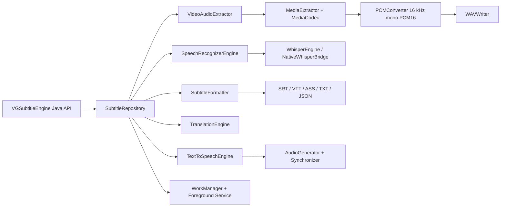

# Architecture

## Layers

- `api`: Java-compatible facade, configs, callbacks, progress, and typed exceptions.
- `extractor`: streaming decode and PCM/WAV conversion.
- `recognizer`: speech engine contracts, Whisper adapter, model manager, language detector, segments.
- `translator`: offline translation contracts and language mapping.
- `subtitle`: segmentation, timestamping, parsing, and file writers.
- `audio`: TTS generation, synchronization, and mixing contracts.
- `muxer`: video/audio muxer contracts for Media3 Transformer, FFmpeg, or native implementations.
- `worker`, `service`, `notification`, `database`: background execution, foreground notification, reboot continuation, and task persistence.

## Dependency Injection

`VGSubtitleEngine` exposes setters for recognizer, translator, and TTS engines. Apps using Hilt/Koin/manual DI can construct the concrete engines and install them before starting work.
